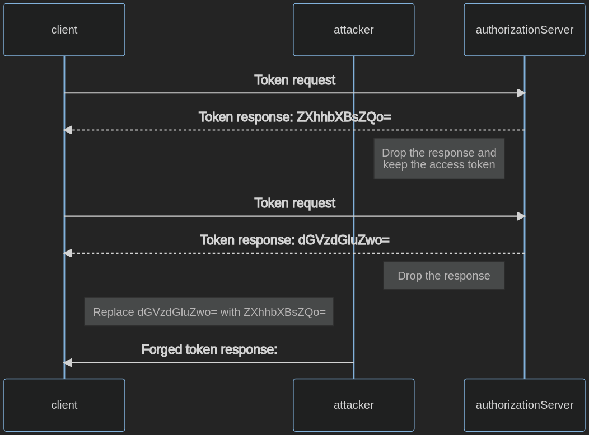

# Testing OAuth Client Weaknesses

|ID            |
|--------------|
|WSTG-ATHZ-05.2|

## Summary

OAuth grants access rights on resources to clients. This allows them to act on behalf of the resource owner. The client receives the authorization and refresh token in the token exchange and stores them.

Failure to protect the token exchange and credentials may result in unauthorized resource access and the elevation of privileges.

## Test Objectives

- Retrieve credentials used for authorization
- Grant yourself access to arbitrary resources trough forceful browsing
- Bypass the authorization

## How to test

### Testing for exposed Client Secret

The client secret is used to authenticate the Client against the Authorization Server in order to proof that the Client is a trusted Origin.

Public clients are not able to store the client secret securely. Some applications can still store it and rely on it, which can lead to assumptions that the client is strongly authenticated which is not the case.

To identify the client secret in client side code one may conduct reconnaissance on the client side code.

1. Browse to the application
2. Open the Developers Toolbar (F12 in the Browser)
3. Navigate to the Debugger Tab
4. Press Ctrl+Shift+F to open the search
5. Type the search term `client-secret` for example

If this is not successful one can also step through the authorization process with a HTTP Interception proxy like OWASP ZAP, gather the client secret from the URI in the parameter `client-secret` and replace the search term of the above search with the value of the client secret to reveal the place where it is stored.

### Testing for improper token storage

The client receives access tokens and needs to store them in a location where those token can be protected from attackers.

Confidential clients should store token in volatile memory to prevent access to them through other attacks like local file inclusion, attackers who are able to access the environment or SQL Injection attacks.

Public Clients like SPAs do not have the possibility to store tokens securely e.G a XSS attack allows attackers to access credentials stored in the browser.

The Public Client may store the token in the Browsers Session Storage or in a cookie but not in the Local Storage.

1. Browse to the application
2. Retrieve an access token
3. Open the Browsers Developers Toolbar (F12 in the Browser)
4. Navigate to the Application Tab
5. Locate the Local Storage and view stored data
6. Locate the Session Storage and view stored data
7. Locate the Cookie Store and view stored data

### Access Token Injection

This attack is only possible when the client uses a response type that directly issues an access token to the client.  
Such grants are the implicit flow, resource owner password credential grant and the machine to machine flow.  

Access Token Injection is done when an access token was leaked to an attacker and the attacker tries to use the access token with the legitimate client.

The example here is an attack against the implicit flow assuming that the authorization token (`ZXhhbXBsZQo=`) was leaked.

1. Intercept the traffic between the client and the authorization server
2. Start an OAuth flow with a client using the implicit grant
3. Inject the stolen access token
    - Send a forged authorization response with the stolen access token (`ZXhhbXBsZQo=`) to the client
    - Intercept a valid authorization response and replace the access token (`dGVzdGluZwo=`) with the leaked one (`ZXhhbXBsZQo=`)

\
*Figure 1: Access Token Injection*

## Related Test Cases

- [Testing for Cross Site Request Forgery](../06-Session_Management_Testing/05-Testing_for_Cross_Site_Request_Forgery.md)
- [Testing for Client-side URL Redirect](../11-Client-side_Testing/04-Testing_for_Client-side_URL_Redirect.md)
- [Testing JSON Web Tokens](../06-Session_Management_Testing/10-Testing_JSON_Web_Tokens.md)
- [Testing for Clickjacking](../11-Client-side_Testing/09-Testing_for_Clickjacking.md)
- [Testing Cross Origin Resource Sharing](../11-Client-side_Testing/07-Testing_Cross_Origin_Resource_Sharing.md)

## Remediation

- Make sure to use a client secret only if the client has the ability to keep them secret
- Follow best practices to store tokens, thread them the same as other credentials
- Consider not to use deprecated oAuth grant types

## Tools

- [BurpSuite](https://portswigger.net/burp/releases)
  - [EsPReSSO](https://github.com/portswigger/espresso)
- [OWASP ZAP](https://www.zaproxy.org/)

## References

- [User Authentication with OAuth 2.0](https://oauth.net/articles/authentication/)
- [The OAuth 2.0 Authorization Framework](https://datatracker.ietf.org/doc/html/rfc6749)
- [The OAuth 2.0 Authorization Framework: Bearer Token Usage](https://datatracker.ietf.org/doc/html/rfc6750)
- [OAuth 2.0 Threat Model and Security Considerations](https://datatracker.ietf.org/doc/html/rfc6819)
- [OAuth 2.0 Security Best Current Practice](https://datatracker.ietf.org/doc/html/draft-ietf-oauth-security-topics-16)
- [Authorization Code Flow with Proof Key for Code Exchange](https://auth0.com/docs/authorization/flows/authorization-code-flow-with-proof-key-for-code-exchange-pkce)